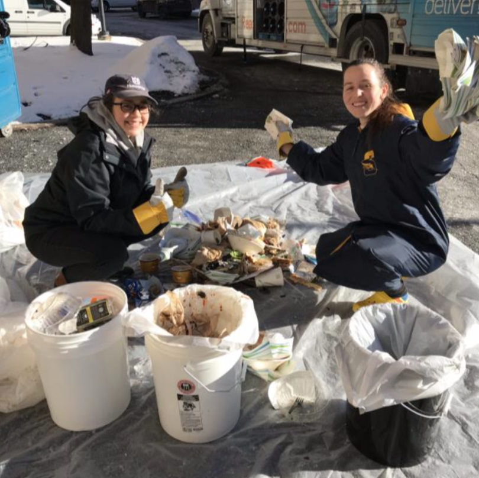
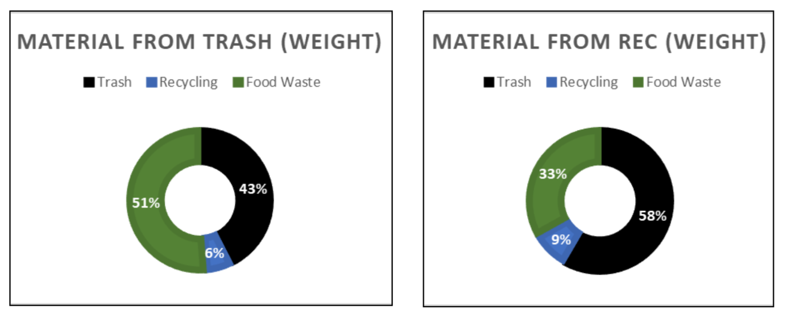
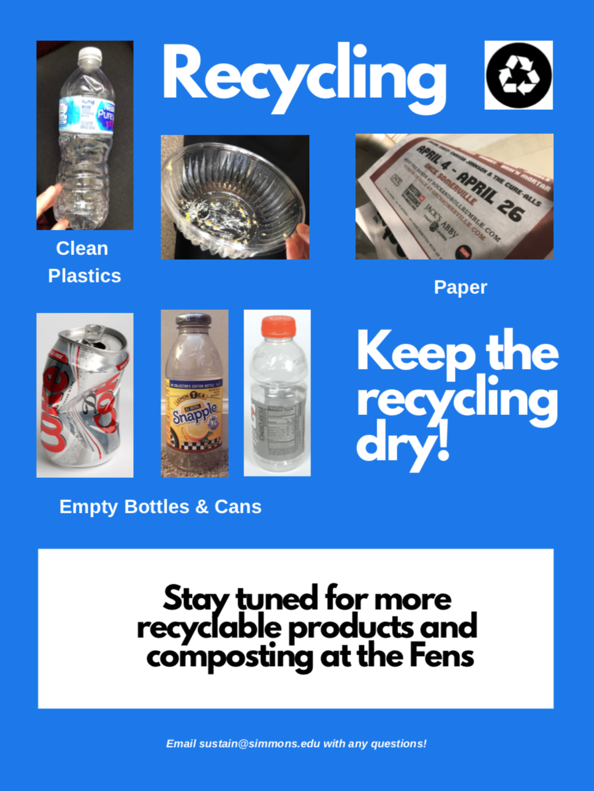
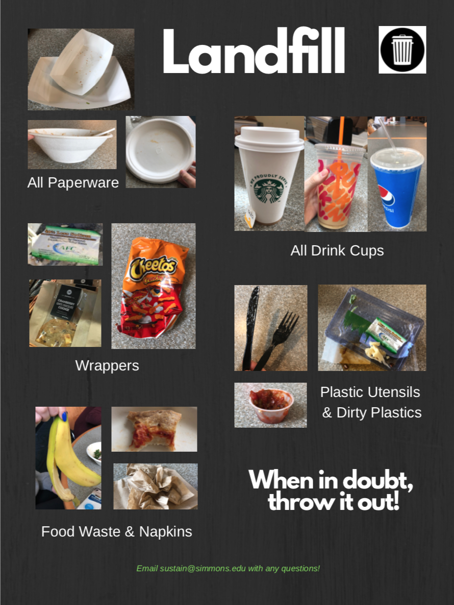
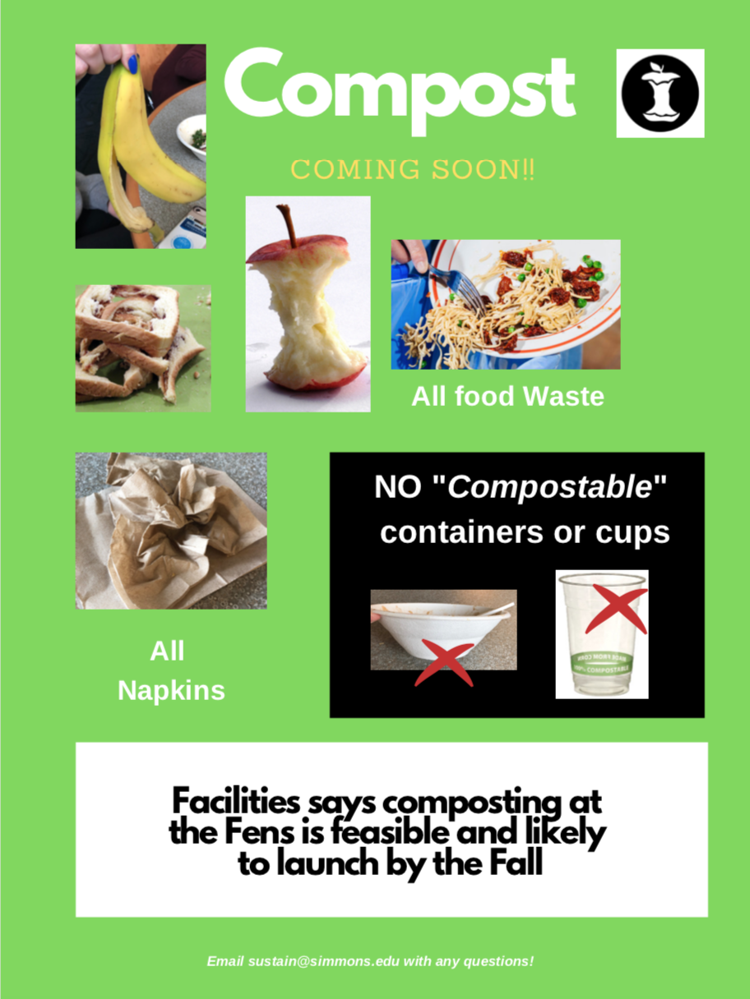
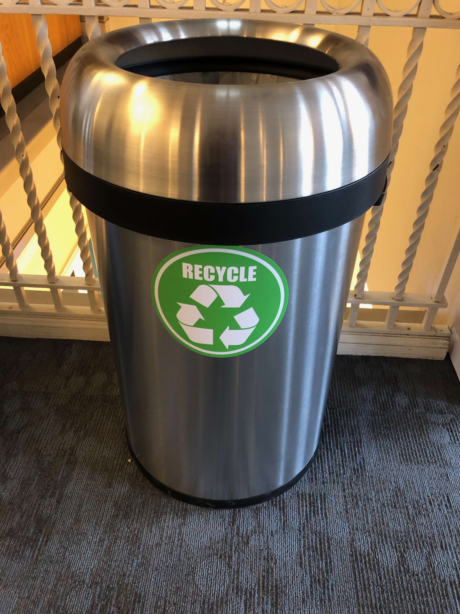
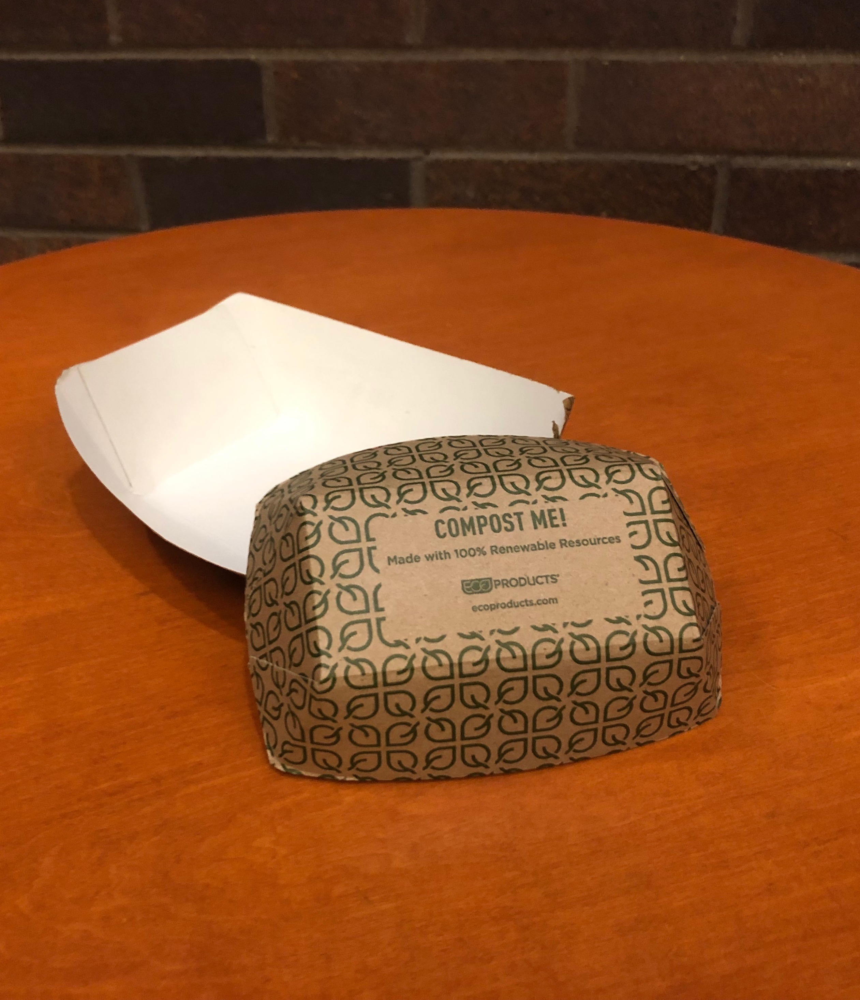
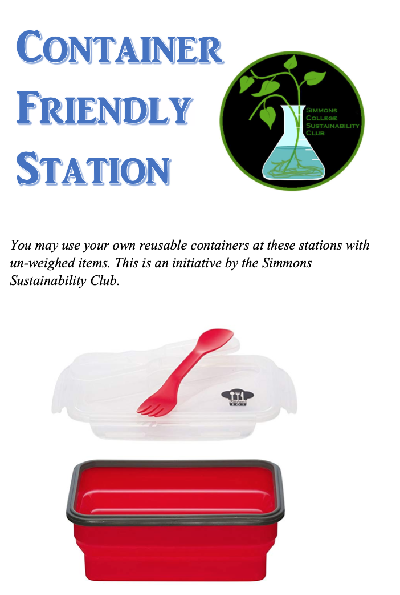

```{r}
library(plotly)
library(ggplot2)
library(tableone)
library(DT)
Recycling <- read.csv("Waste_Simmons_Final.csv")
Recycling <- Recycling[-c(4),] #Eliminating the outlier of October 2015 where there was no rec

#Finding cumulative waste
Recycling$Total_Cum <- 0
Recycling$Total_Cum[1]<-Recycling$Total[1]
for (i in 2:(nrow(Recycling)-1)){
  Recycling$Total_Cum[i] <- Recycling$Total_Cum[i-1] + Recycling$Total[i]
}
#write.csv(Recycling, "cumulative.csv")
```

Summary 
===================================== 

Row {data-width=700}
-------------------------------------
###Overall Trend
```{r}
#Adapted from: https://stackoverflow.com/questions/40916252/ggplot-stacked-bar-graph-with-2-columns

plot_ly(data=Recycling, x = ~Key, y = ~Composted, name = 'Composted', type = 'bar',color = I("#98FB98")) %>% 
  add_trace(y = ~Recycled, name = 'Recycling', color = I("#56B4E9")) %>% 
  add_trace(y = ~MSW, name = 'MSW', color = I("#ff4d4d")) %>%  
    layout(title="Simmons Waste 2015-2018",yaxis = list(title = 'Tonnage'), xaxis = list(title="Month/Year"), barmode = 'stack', legend = list(orientation = "v", xanchor = "left", x = 0))
```

Row {data-width=300}
-------------------------------------
### Simmons Waste (2015-2018)
  + While there are some monthly trends that occur throughout each year as students come and go, from year to year the data generally stays the same. 
  + On average we generate nearly 24,000 pounds of waste per year at a school, which equates to about 2 African Elephants!

###Monthly Trend
```{r}
Recycling$Year <- as.factor(Recycling$Year)
ggplot(data=Recycling, aes(x=Month, y=MSW, group = Year)) +
geom_line(aes(color=Year))+ scale_color_brewer(palette = "Set1") +  labs(title="Municipal Solid Waste Over Time",x="Time (Month)", y = "MSW (Tonnage)")
```


The Issue
===================================== 
Column
-------------------------------------
###The Issue
**Simmons is Living in the Past!**
<br/> Simmons consistently falls below the national average of ~35% of waste recycled, and is most closely aligned to rates of the early 2000s. 

**The Fens had a 91% rate of contamination**
<br/>This Spring, the Sustainability Club conducted a waste audit in the Fens to see how well Simmons was doing in terms of recycling, and to determine if composting was a possibility. The recycling actually had _more_ trash than the actual trash, with 58% trash and 33% food waste! Obviously this is very poor, and to make it worse, China is now only accepting loads with 0.5% contamination or less. 

###Fens Waste Audit- Student Participation
```{r}

```

Column
-------------------------------------
###National Rates
```{r}
knitr::include_graphics('nat_comp.png')
```

###Waste Audit- High Contamination Rates
```{r}

```

The Data 
===================================== 

Column {}
-------------------------------------
### The Data
**Variables**
<br/>_MSW_: Tonnage municipal solid waste in month i
<br/>_Recycled_: Tonnage recycled in month i
<br/>_Composted_: Tonnage composted in month i
<br/>_Total_: Tonnage of total waste (MSW, Recycled, Composted combined)
<br/>_Num_Res_:Number of students living on the residence campus that month
<br/>_Event_Count_: Number of events that occurred that month
<br/>_Event_HC_: The sum of all event headcounts for that month
<br/>_Average_HC_: The average headcount at events during that month
<br/>_Days_InSession_: Number of class days

<br/>**Data Sourcing**  
_Recycling, Municipal Solid Waste, Compost data_ 
<br/> Provided by Casella Waste, our contractor
<br/> Obtained from Joan Martinez Cuerva <joan.martinezcuerva@simmons.edu>

_Residential students_
<br/> Provided by Simmons Residence Life
<br/> Obtained from Amelia McConnell <amelia.mcconnell@simmons.edu>
<br/> Summer months were estimated to be 100 students on res, since data was unavailable.

_Events data_ 
<br/> Provided by Conferences at Simmons office
<br/> Obtained from Nicole Vanderpol <nicole.vanderpol@simmons.edu>

_Days in Session data_
<br/> Estimated from the 2018-2019 academic calendar

Column {}
-------------------------------------
### Dataset
```{r}
datatable(Recycling[,c(2:10)])
```


Regressions
=====================================  
Input {.sidebar, data-width: 200}
-------------------------------------
### Regression Analyses
I performed a series of regression analysis predicting the 4 dependent variables to the right.
<br/> <br/> Overall, it was challenging to truly capture the variability in the data. The best model I found was the model predicting total waste, from days in session.I attempted multiple regression, however the variables often lost their significance when I added more than one variable-- a sign of multicollinearity --and did not dramatically improve the R^2.
<br/> <br/> A surprising result, was the negative relationship with students living on re campus and recycling rates. This requires further analysis with more background information from facilities, perhaps. It is interesting that an increase in events leads to higher composting tonnage, but leads to a decrease in the percent recycled. It makes me think about the types of waste generated from events: more food preparation would mean more compost, but the single use plates used at many events would mean more trash relative to recyclables. 

Column
-------------------------------------
###<span style="color:#56B4E9">**Recycling**</span>
  + For every 100 **students on Res**, Percent Recycled decreases by 0.1%; Tonnage recycled decreased by 0.04 tons or 80 pounds. 
  + With an additional **10 events** per month, Percent Recycled decreases by 0.01% 
  + For each additional **day in session**, Percent Recycled decreases by 0.004%
  

###<span style="color:#98FB98">**Compost**</span>
  + With each additional **day in session** per month, % composted increases by 0.09%
  + For each additional **event** during the month, composting increases by 0.02 tons or 40 pounds

Column
-------------------------------------
###<span style="color:#ff4d4d">**Municipal Solid Waste**</span>
  + For every additional 1000 **people** at events_ per month, MSW increases by 0.9 tons
  + For every 1 additional **event** per month, MSW increases by 0.1765 tons (350 Ilbs). 
  + For every 1 additional **day in session** per month, MSW increases by 0.6511 tons (1,300 Ilbs)

###**Total Waste**
  + For each additional **day in session** that month, Total Waste increases by 0.8 tons, (1,600 Ilbs). Explains about half the variation in waste. 
  + For each additional **event** that month, Total Waste increased by 0.2 tons or 400 Ilbs. 


Action
===================================== 
Row {}
-------------------------------------
###**Action**
_This year the Sustainability Club worked with facilities on a variety of projects to improve waste management at Simmons. Click on the tabs to the right to explore._

1. **Updated Waste Bin Signage**
    * Old signage was incorrect and not descriptive enough for student's needs
    * We predict the poor signage was a big indicator in the contamination rates

2. **Front-End Composting**
    * Currently, dining services composts in the back-end, while preparing food
    * Front-end composting at the bins in the Fens is likely to launch in the fall!

3. **New Waste Bins **
    * Facilities purchased new recycling bins for the Main College Building this year
    * For the fall, they are ordering new bins for the stations in the Fens. This will help the issue of folks contaminating the recycling, when trash bins fill up.

4. **New container products**
    * Currently, the majority of materials in the Fens are not recyclable or compostable 
    * Facilities bought a new version of the food boats, that is compostable since it is lined with PLA plastic, which can biodegrade

5. **Reusable containers**
    * This year, the club launched a policy allowing you to bring your own container to the Fens for unweighed items.
    * Weighed items could be included if the container was all the same size, however there are also health-safety concerns with using your own container at a buffet. 
    * The longterm goal is to have all reusable containers at the Fens and eliminate container waste completely


Row {.tabset .tabset-fade}
-------------------------------------
### Recycling Signage
```{r}

```

### Landfill Signage
```{r}

```

### Front-end Composting
```{r}

```

### New Recycling Bins
```{r}

```

### Compostable Food Boats
```{r}

```

### Reusable Containers
```{r}

```


